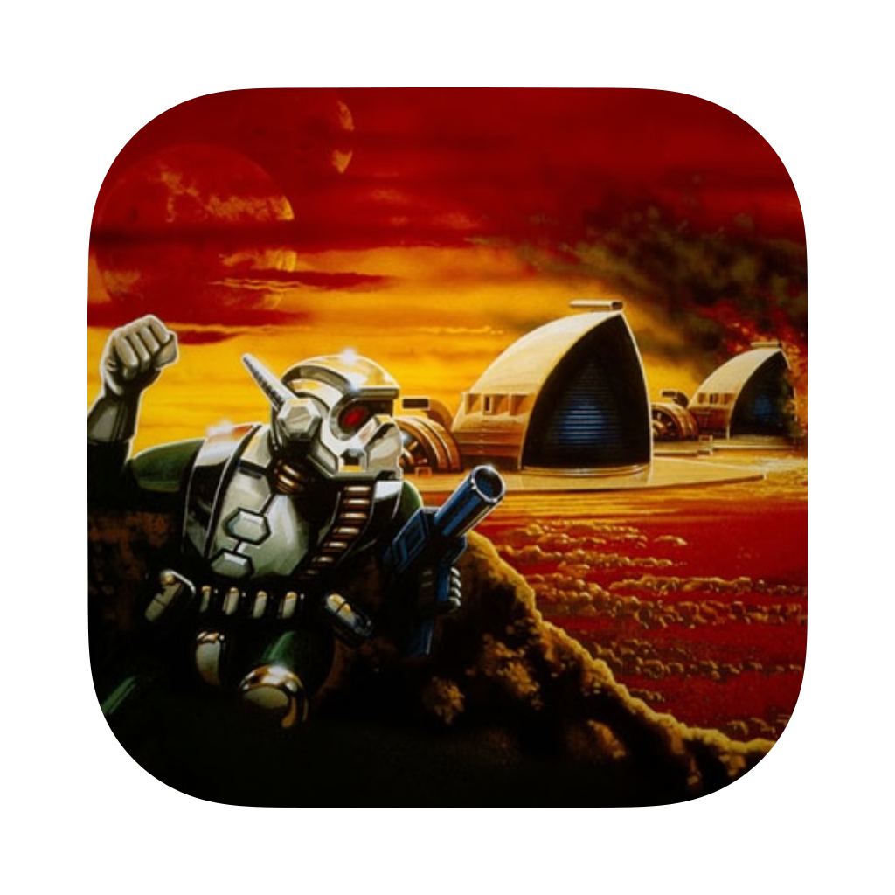

# Dune II Build Script

Script for building Dune II for macOS using [OpenDune](https://github.com/OpenDUNE/OpenDUNE)

Game data from v1.07 of the original game is required, and should be placed in your Application Support folder

> [!NOTE]
> There may be small graphical corruptions on Apple Silicon builds 
> If it occurs, add the following to `opendune.ini` 
> `[opendune]` 
> `renderer_software_fallback=1`